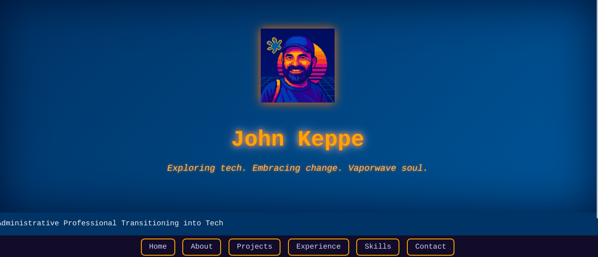

## Hi there 👋

My name is **John Keppe**  

and I am a tech-savvy individual and a Neural Novice seeking to transition into an entry-level tech role.

## 🗺️ Navigation
- `index.html` → Splash homepage with retro vibes
- `/portfolio-site/` → AI-assisted vaporwave portfolio
- `/resume/` → Styled GitHub resume (Gemini-enhanced)
- `/neocities-demo/` → Raw resume HTML coded from scratch
- `/copilot-credits/` → Special thanks to Microsoft Copilot

## 📦 Projects
### 🌠 Portfolio Site
My first major build with Copilot support, showcasing:
- Responsive design
- Vaporwave theme
- EmailJS integration
- SEO setup using Google Search Console

### 🧩 Resume: HTML from Scratch
Coded manually with no AI assistance to test my foundational skills:
- HTML5 + inline CSS
- Semantic layout
- Custom favicon
- Hosted on Neocities

### 💎 Enhanced Resume (Gemini-Assisted)
Stylized version built with help from Google Gemini, but the core structure was hand-coded:
- Modern layout enhancements
- Typography and color upgrades

<h3>Portfolio Project</h3>

Portfolio Site <a href:>https://keppe-john.github.io/portfolio-site/</a>

In regards to the Portfolio website I allowed Microsoft CoPilot to handle all of the heavy lifting as I began learning the ropes. It was an arduous project trying to encorporate a contact page using EmailJS and SEO using Google Search Console as I was learning to use HTML and CSS. I endured the setbacks and powered through all of the debugging to help create a very cool vaporware inspired responsive website. After successfully spending many hours on this project I was curious if I could actually build my own basic HTML/CSS website without any AI assistance. 

  
<strong>🤖 Special Thanks</strong> 
  I'd like to credit Microsoft Copilot for helping me brainstorm, debug, and build the portfolio project with style.

    

<h3>Resume Project</h3>

Using the Text app on my Chromebook I proceeded to slowly and methodically (testing every new element before moving on to the next one) build a simple resume webpage <a href:>https://johnkeppe-resume.neocities.org</a>. It took me a few hours of tweaking and debugging my errors but I finally got it working the way I wanted it to look and it looks marvelous, in my own opinion. I then proceeded to use Neocities to publish my "raw" resume HTML/CSS in order to showcase what I have learned working with AI on the Portfolio project or at least the basics of HTML/CSS at least.

> I then decided to style the HTML/CSS resume using Google Gemini and host it on my GitHub <a href:>https://keppe-john.github.io/resume/</a> and linked the Neocities to my GitHub enhanced version to show the differences. And eventhough Google Gemini added the bells and whistles the basic structure is all mine.

    

  

  
    🔮 Vaporwave Break 🔮
  

---

## 📸 Preview Screenshots

---

## 🚧 Growth & Reflections
This project was my rite of passage from curiosity to capability. I combined raw effort, AI tools, creative design, and trial-and-error debugging to build something uniquely mine. AI gave me the confidence and framework, but I put in the grit. These pages stand as proof that I’m ready to bring that same balance of artistry and persistence into a professional dev environment.

